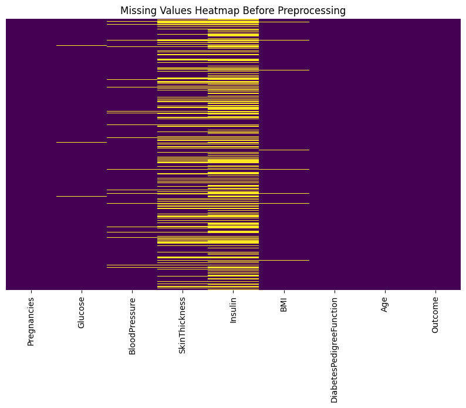
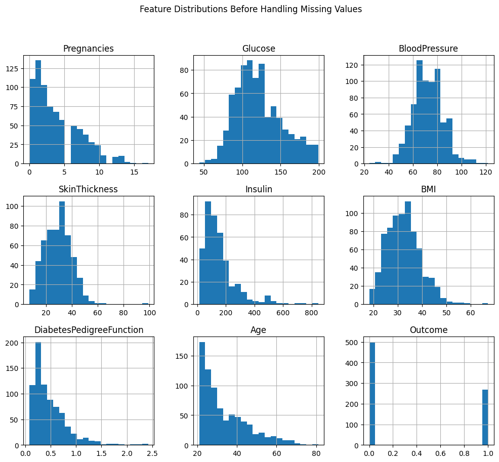
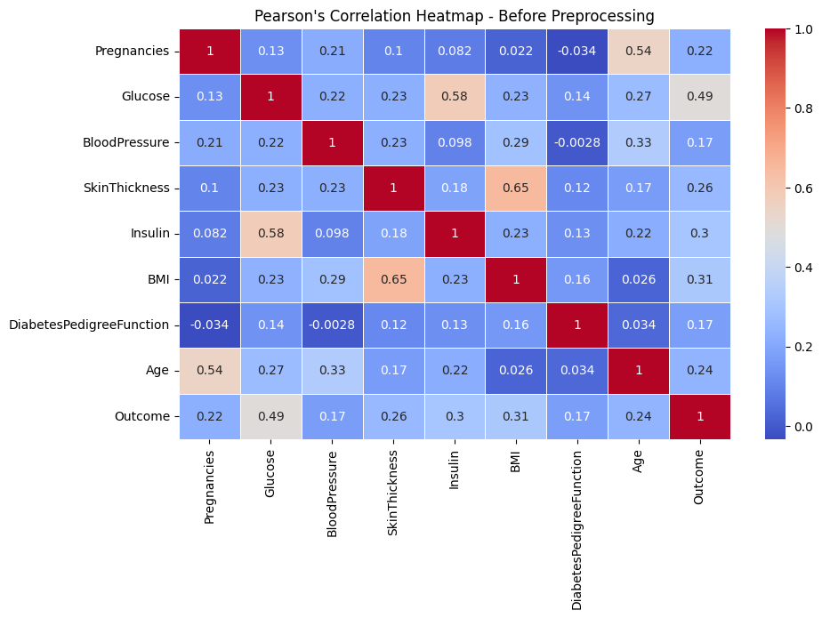
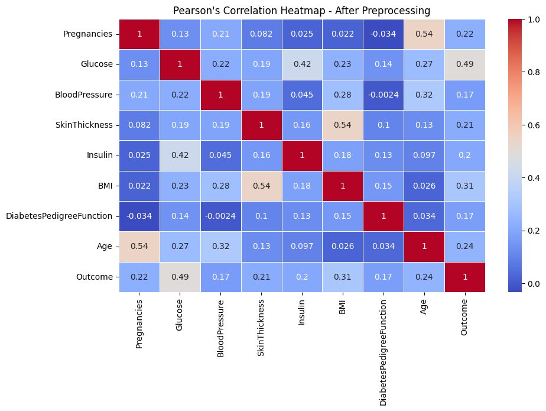
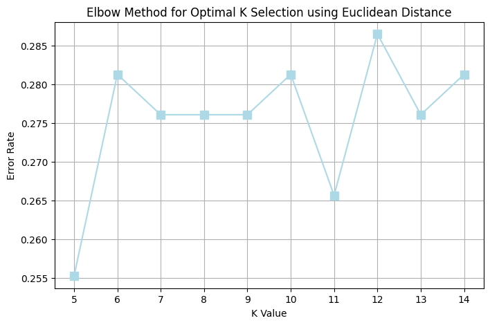
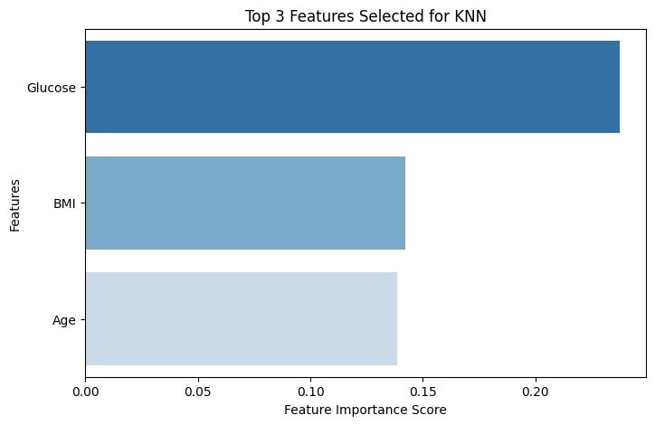
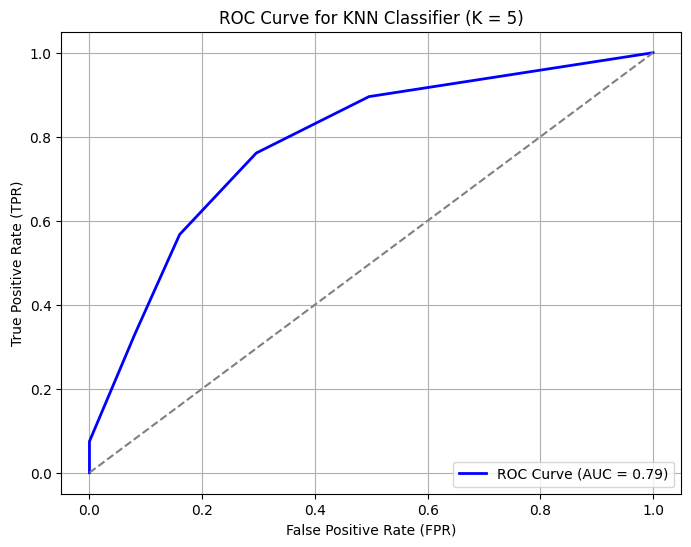
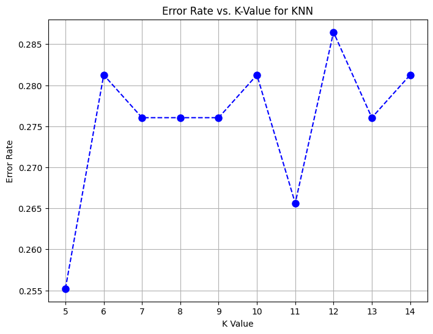

[# 🩺 Diabetes Risk Prediction with KNN Classifier


An end-to-end machine learning pipeline to predict diabetes risk using K-Nearest Neighbors (KNN) classification — covering data preprocessing, exploratory analysis, feature selection, model tuning, and evaluation.

---

## 🎯 Problem Statement

Diabetes affects millions globally and early detection significantly improves patient outcomes. This project builds a binary classification model to predict whether a patient is diabetic based on clinical health indicators such as glucose levels, BMI, and age.

---

## 📊 Dataset

**Source:** [Pima Indians Diabetes Dataset – Kaggle](https://www.kaggle.com/datasets/uciml/pima-indians-diabetes-database)

| Property | Details |
|----------|---------|
| Samples | 768 patients |
| Features | 8 clinical indicators |
| Target | Binary — Diabetic (1) / Not Diabetic (0) |
| Class Split | 500 non-diabetic, 268 diabetic |

---

## 🔍 Approach

### 1️⃣ Exploratory Data Analysis
- Identified missing/zero values in clinical features (invalid medical readings)
- Analyzed feature distributions and class imbalance
- Computed Pearson correlation to understand feature relationships

### 2️⃣ Data Preprocessing
- Replaced biologically invalid zero values with median imputation
- Applied StandardScaler normalization for KNN distance calculations
- Compared correlation structure before and after preprocessing

### 3️⃣ Feature Selection
- Used feature importance scoring to identify top predictors
- Selected top 3 features: **Glucose, BMI, Age**

### 4️⃣ Model Tuning
- Applied Elbow Method to find optimal K value
- Evaluated error rate across K = 5 to 14
- Selected **K = 5** as optimal based on lowest error rate

### 5️⃣ Model Evaluation
- Evaluated using ROC-AUC, confusion matrix, precision, recall

---

## 📈 Results

### Missing Values — Before Preprocessing



> SkinThickness and Insulin had the highest proportion of invalid zero values — replaced with median imputation.

---

### Feature Distributions



> Glucose follows a near-normal distribution. Insulin and SkinThickness show heavy right skew — confirming the need for imputation.

---

### Pearson Correlation — Before Preprocessing



---

### Pearson Correlation — After Preprocessing



> Preprocessing reduced spurious correlations — notably Insulin's correlation with SkinThickness dropped from 0.18 → 0.16 after removing invalid zeros.

---

### Elbow Method — Optimal K Selection



> K = 5 selected as optimal — lowest error rate of **0.255** across all tested values.

---

### Top 3 Features Selected for KNN



> **Glucose** is by far the strongest predictor, followed by BMI and Age — consistent with clinical diabetes risk factors.

---

### ROC Curve — KNN (K=5)



> **AUC = 0.79** — the model significantly outperforms random classification (AUC = 0.5).

---

### Confusion Matrix — KNN (K=5)


| Metric | Value |
|--------|-------|
| True Negatives (correctly predicted non-diabetic) | 105 |
| True Positives (correctly predicted diabetic) | 38 |
| False Positives | 20 |
| False Negatives | 29 |
| **Accuracy** | **~74.5%** |
| **AUC-ROC** | **0.79** |

---

### Error Rate vs K Value



> Error rate stabilizes around 0.276 for most K values — K=5 and K=11 show the lowest error rates.

---

## 💡 Key Learnings

- Glucose is the single most important predictor of diabetes risk — aligns with clinical evidence
- Zero-value imputation significantly improved model reliability for SkinThickness and Insulin features
- KNN is sensitive to feature scaling — StandardScaler was critical before training
- AUC of 0.79 is solid for a KNN baseline; ensemble methods like Random Forest or XGBoost could push this further

---

## 🛠️ Tech Stack

`Python` `Scikit-learn` `Pandas` `NumPy` `Matplotlib` `Seaborn` `Jupyter Notebook`

---

## 🚀 How to Run

```bash
git clone https://github.com/Diviya-tech/Diabetes-Risk-Prediction-with-Machine-Learning
cd Diabetes-Risk-Prediction-with-Machine-Learning
pip install -r requirements.txt
jupyter notebook
```

---

## 📁 Project Structure

```
Diabetes-Risk-Prediction-with-Machine-Learning/
├── Results/
│   ├── missing_values_heatmap.png
│   ├── feature_distributions.png
│   ├── correlation_before.png
│   ├── correlation_after.png
│   ├── elbow_method.png
│   ├── feature_importance.png
│   ├── roc_curve.png
│   ├── confusion_matrix.png
│   └── error_rate_kvalue.png
├── notebooks/
├── README.md
└── requirements.txt
```

---

## 🔮 Future Improvements

- Compare KNN against Random Forest, XGBoost, and Logistic Regression
- Address class imbalance using SMOTE oversampling
- Build a Streamlit web app for real-time risk prediction
- Explore deep learning approach for improved recall on diabetic class

---

## 📬 Connect

[](https://linkedin.com/in/sridivyadasari)
[](https://github.com/Diviya-tech)
](https://diabetes-risk-prediction-with-machine-learning-boyy5wpj7c9bfhh.streamlit.app/)
